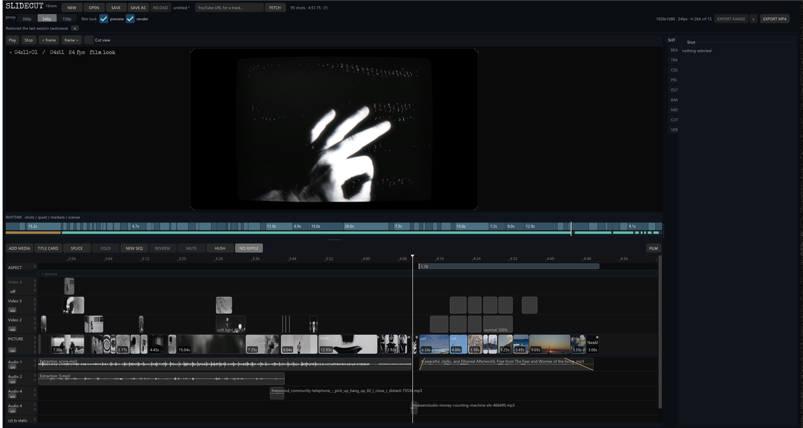
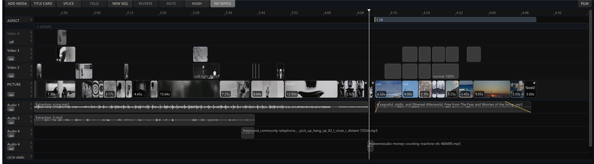
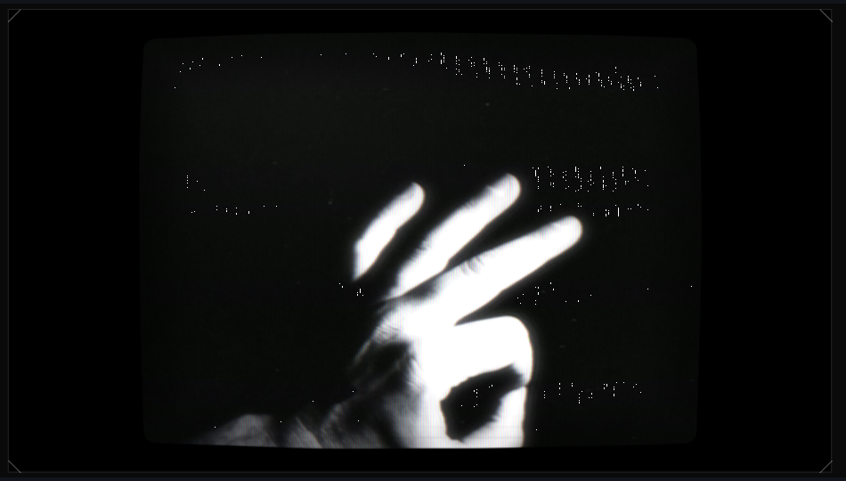

# SlideCut

A fast, keyboard-and-mouse video editor for hard-cut films built from stills and clips — with a real-time 16mm projector / CRT look — that exports straight to H.264 MP4 through ffmpeg.

Native Windows app: C++17, Dear ImGui, Direct3D 11, miniaudio.



## Features

- **Timeline editing** — base picture track that packs shots end to end, free-standing overlay video tracks, multiple audio tracks, and an aspect-ratio track that changes the frame over time. Ripple on/off, splice at playhead, reverse, mute, beat quantize.
- **Images and video** — drop in stills or clips; video gets background JPEG proxies (360p / 540p / 720p) with prefetch for smooth playback.
- **Sequences** — fold a selection into a nested sequence, open it, unfold it again.
- **Hypercut** — chop overlapping shots on different tracks into rapid alternating cuts, by seconds or frames.
- **Scene split** — detect cuts inside a clip with ffmpeg's scene score and split automatically.
- **Per-shot looks** — colour grade, black and white, double exposure with ffmpeg blend modes, burned-in text overlays, title cards.
- **Film look** — GPU projector shader in the live preview: gate weave, curtain ripple, chromatic aberration, halation, lamp flicker, dust, hair, scratches, vignette, grain, and a ragged projector gate. Plus a CRT look with glow, aperture grille, and TV static noise beds.
- **Audio** — per-clip volume and fades drawn on the timeline, audio FX chain, -14 LUFS loudness normalisation, and track fetch from a YouTube URL (via yt-dlp).
- **Rhythm strip** — shot lengths, quiet passages, markers, and scenes at a glance.
- **Export** — whole film or a range, H.264 (x264 or NVENC) + AAC, BT.709, fast start. The film look is rendered in a second pass at full output resolution.
- **Safety nets** — autosave, timestamped backup snapshots, undo, and plain-text `.slidecut` project files.





## Requirements

- Windows 10 or later, a GPU with Direct3D 11
- [ffmpeg](https://ffmpeg.org/) on `PATH` (proxies, scene detection, export)
- Optional: Python 3 with `moderngl` and `numpy` for the film-look export pass (`projector_render.py`)
- Optional: [yt-dlp](https://github.com/yt-dlp/yt-dlp) on `PATH` for fetching tracks

## Build

CMake 3.16+ with MSVC or MinGW-w64:

```sh
cmake -S . -B build
cmake --build build --config Release
```

The build copies `assets/` and the helper scripts next to `SlideCut.exe`.

Tests (workspace compatibility, UI, media round-trip when ffmpeg is present, and HLSL shader compilation when Python is present):

```sh
ctest --test-dir build
```

## Usage

1. Run `SlideCut.exe`.
2. **ADD MEDIA** or drag images, videos, and audio onto the window.
3. Arrange shots on the timeline; select a shot to edit it in the side panel.
4. Toggle **film look** for the projector preview.
5. **EXPORT MP4** (or set a range and **EXPORT RANGE**).

The film-look pass can also run standalone:

```sh
python projector_render.py in.mp4 -o out.mp4 --res 4k
```

## License

SlideCut is licensed under the [GNU General Public License v2.0](LICENSE).

## Third-party

- [Dear ImGui](https://github.com/ocornut/imgui) — MIT
- [miniaudio](https://miniaud.io/) — public domain / MIT-0
- [stb_image](https://github.com/nothings/stb) — public domain / MIT
- [Special Elite](https://fonts.google.com/specimen/Special+Elite) font — Apache 2.0
